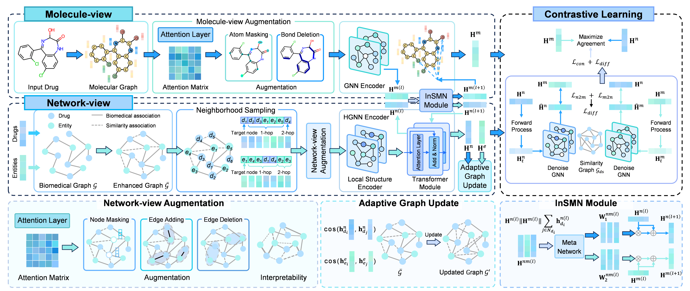

# DrugXAS
Interpretable and Adaptive Graph Contrastive Learning with Information Sharing for Biomedical Link Prediction

<p align="center">
  
</p>

## Requirements:
- python 3.11.9
- cudatoolkit 12.6
- pytorch 2.1.0
- dgl 2.0.0
- Rdkit 2024.3.5 
- numpy 1.26.4
- scikit-learn 1.5.1

## Data:
The data files needed to run the model, including LuoDTI, ZhengDTI, LiangDDA, ZhangDDA, PwuwelsDSE, HuangMDA and DengCDA.
- Adj.csv: The adjacency matrix of the biomedical heterogeneous graph
- DTI/DDA/DSE/MDA/CDA.csv: The known links
- Drug_sim.csv: The similarity measurements of drugs
- Druginformation.csv: The drug SMILES for constructing molecular graphs
- Protein_sim/Disease_sim/SideEffect_sim/miRNA_sim/circRNA_sim.csv: The similarity measurements of different types of entities

## Usage:
### Pre-training
Execute ```python train_finetune.py --pre_train True``` for pre-training
### Fine-tuning
Execute ```python train_finetune.py --pre_train False``` for fine-tuning with the pre-trained models in ```./model_save/```
### Cold-start Prediction
Execute ```python train_cold.py --pre_train False``` for fine-tuning under cold-start settings with the pre-trained models in ```./model_save/```

## Feedback

If you have any issue about this work, please feel free to contact me by email: 
* Liujk1997@gmail.com
